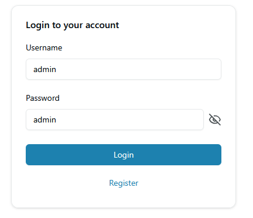
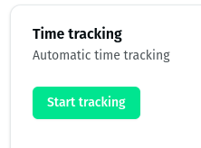

# Dokumentacija

## #1 - Dodajanje uporabnikov

Uporabnik z administratorskimi pravicami ima dostop do zavihka `Users`, kjer mu akcija `Create user` omogoča dodajanje novega uporabnika v sistem. Novemu uporabniku mora določiti unikatno uporabniško ime, ime, priimek, e-poštni naslov, vlogo v sistemu in geslo.

## #2 - Vzdrževanje uporabniških računov

Uporabnik z administratorskimi pravicami ima dostop do zavihka `Users`, kjer se prikaže tabela vseh uporabnikov sistema. S klikom na uporabnika lahko administrator vidi in spreminja uporabniške podatke in pravice. Uporabniku lahko nastavi tudi novo geslo ali uporabnika izbriše.

## #4 - Dodajanje projekta

Vsak uporabnik ima dostop do zavihka `Projects`, kjer se prikaže tabela projektov. Uporabnik z administratorskimi pravicami ima dostop do vseh projektov, ostali uporabniki pa do projektov, kjer so navedeni kot člani.

S klikom na `Create project` lahko uporabnik ustvari nov projekt, na katerem ima vlogo `Scrum master`.

## #5 - Vzdrževanje projekta

Na strani projekta ima pravico urejanja podatkov administrator in uporabnik z vlogo na projektu `Scrum master`.

V oknu `Product details` je izpisano ime projekta. S klikom an `Edit` lahko uporabnik spremeni naziv projekta. Nov naziv ne sme biti prazen ali že uporabljen.

S klikom na `Add member` se pojavi obrazec za dodajanje novega člana projekta, s klikom na `Edit` pa se ureja obstoječega. Možno je izbrati uporabnika in vlogo.

## #30 - Prijava v sistem

Uporabnik si lahko ustvari nov uporabniški račun s klikom na `Register`. Izbrati si mora unikatno uporabniško ime, izpolniti podatke o imenu, priimku, e-pošti in dvakrat vpisati izbrano geslo. Geslo mora biti dolgo vsaj 12 znakov.

S klikom na ikono ob polju za geslu lahko uporabnik geslo razkrije.

Po registraciji se lahko v sistem prijavi z izbranim uporabniškim imenom in geslom.

## #3 - Spreminjanje lastnih uporabniških podatkov

Uporabnik v zavihku "Profile Settings" lahko spreminja svoje uporabniško ime, e-poštni naslov in geslo. Za spremembo gesla mora vnesti staro geslo, za katero se preveri, da je pravo. Podvajanje uporabniškega imena se preverja in če pride do kakšne neregularnosti ali napake vmesnik uporabnika obvesti o tem.

## #6 - Ustvarjanje novega sprinta

Uporabniku so predstavljeni vsi sprinti na projektu.
Prijavljen uporabnik lahko na projektu doda nov sprint s klikom na gumb `Add sprint`:

Uporabnik mora vnesti podatke o sprintu:

Aplikacija preveri ustreznost vnesenih polj:

- Sprint ima unikatno ime (v sklopu projekta);
- Začetni datum ni v preteklosti;
- Končni datum ni pred začetnim;
- Hitrost sprinta mora biti pozitivno število;
- Sprint se ne prekriva s katerimkoli drugim sprintom znotraj projekta.

V primeru zaznane napake aplikacija obvesti uporabnika in onemogoči izdelavo sprinta, dokler napaka ni razrešena.

## #7 - Vzdrževanje obstoječih sprintov

Uporabnik lahko s klikom na ime sprinta v seznamu na projektu uredi ali izbriše sprint:

Aplikacija preveri ustreznost vnesenih polj:

- Sprint ima unikatno ime (v sklopu projekta);
- Začetni datum ni v preteklosti;
- Končni datum ni pred začetnim;
- Hitrost sprinta mora biti pozitivno število;
- Sprint se ne prekriva s katerimkoli drugim sprintom v projektu.

V primeru zaznane napake aplikacija obvesti uporabnika in onemogoči izdelavo sprinta, dokler napaka ni razrešena.

## #8 - Dodajanje uporabniških zgodb

Administrator, prodkutni vodja in skrbnik metodologije lahko s klikom na gumb "Add Story" na nadzorni plošči za projekt ustvarjajo nove uporabniške zgodbe. Preverjajo se vsa dovoljenja, povezana z vlogami, tako v uporabniškem vmesniku kot na strežniku.

- Naslov uporabniške zgodbe se ne podvaja.
- Preverja se, da je poslovna vrednost število.
- Preverja se, da je prioriteta ena od 4 zahtevanih opcij.

Za primer, gumb "Add Story" vidijo le pooblaščene osebe (administrator in zgornji vlogi).

## #9 - Urejanje in brisanje uporabniških zgodb

Administrator, prodkutni vodja in skrbnik metodologije lahko s klikom na prikazano uporabniško zgodbo urejajo njene parametre, lahko pa jo tudi zbrišejo s klikom na rdeč gumb. Preverjajo se vsa dovoljenja, povezana z vlogami, tako v uporabniškem vmesniku kot na strežniku.

- Naslov uporabniške zgodbe se ne podvaja.
- Preverja se, da je poslovna vrednost število.
- Preverja se, da je prioriteta ena od 4 zahtevanih opcij.

Za primer, če uporabnik nima primernih pravic, sicer vidi seznam nalog, ne more pa s klikom odpreti obrazca za urejanje.

## #11 - Ocena časovne zahtevnosti

Skrbnik metodologije lahko uporabniški zgodbi določi in spremeni oceno časovne zahtevnosti.

Aplikacija pred shranjevanjem podatkov preveri ustrezne uporabniške pravice in pravilen vnos časovne ocene.
V primeru napačnega vnosa je shranjevanje onemogočeno.

## #13 - Dodajanje zgodb v Sprint

Skrbnik metodologije lahko doda zgodbe v sprint.

To stori tako, da v spustnem meniju izbere sprint projekt, v katerega želi dodati zgodbo in klikne na gumb Update sprint. V primerju, da zgodba še nima določene ocene časovne zahtevnosti ali je že realizirana, sprinta ne moremo spreminjati.

## #15 - Vzdrževanje obstoječih nalog

Dokler naloga ni sprejeta, ji lahko skrbnik metodologije in člani razvojne skupine urejajo vse parametre ali jo izbrišejo.

## #16 - Sprejemanje nalog

Če razvijalcu dodelimo nalogo (pri dodajanju ali urejanju naloge ga izberemo v polju `Assignee`) in je naloga v stanju `pending`, razvijalec ob nalogi vidi akcijo `Accept`. Ob kliku se nalogi stanje spremeni v `accepted`.

## #18 - Beleženje porabe časa

Uporabnik, ki ima vlogo razvijalca, lahko avtomatično beleži porabo časa na sprejeti nalogi.
Ob sprejemu naloge, se prikaže povezava `Manage`, ki vodi na stran za upravljanje s časom.
Uporabnik lahko začne beležiti čas na nalogi, v kolikor ne beleži čas na drugi nalogi.
V tem primeru aplikacija prikaže opozorilo.
S ponovnim klikom na gumb se beleženje časa ustavi in delo se pripiše vsoti ur za ta delovni dan.

## #19 - Pregledovanje in spreminjanje časovnega poteka dela

Uporabnik lahko ureja zgodovino svojega dela na nalogi.
Ureja lahko le dneve v preteklosti.
Uredi lahko porabljen in pričakovan čas za dokončanje naloge.

Uporabnikom se prikaže vsota porabljenega časa na določeni nalogi (za vse razvijalce skupaj).
Začetna vrednost pričakovanega časa se preipiše s tisto, ki jo je nastavil razvijalec.
Tabela nalog na dnu prikaže tudi vsoto porabljenega časa za vse naloge skupaj.
Ko se pričakovani čas nastavi na `0h 0m 0s`, se nalogi omogoči prehod v dokončano stanje (Realized).

## #20 - Zaključevanje nalog

Če je naloga v stanju `accepted` in je ocenjeni preostanek dela 0, lahko član skupine, ki je nalogo sprejel, to označi kot `Realized`.

## #21 - Vzdrževanje uporabniške dokumentacije

Vsi uporabniki, ki lahko vidijo projekt, lahko vidijo napisano dokumentacijo projekta.

Prav tako lahko dokumentacijo:

- urejajo v enostavnem markdown urejevalniku,
- uvozijo iz markdown datoteke z končnico .md
- izvozijo in prenesejo na lokalni računalnik.

## #22 - Objavljanje na projektnem zidu

Vsi uporabniki na projektu lahko vidijo projektni zid in nanj pripenjajo nove objave.

## #27 - Seznam zahtev

Vsi člani projekta si lahko ogledajo seznam zahtev (Product Backlog), kjer so zbrane vse uporabniške zgodbe projekta.

Zgodbe so v seznamu zahtev razdeljene med:
- nerealizirane, ki pripadajo aktivnemu sprintu.

- nerealizirane, ki pripadajo ostalim sprintom ali nobenem sprintu. Zgodbe so vizualno grupirane po sprintih, katerim pripadajo. Na dnu pa se nahajajo zgodbe, ki ne pripadajo nobenemu sprintu.

- realizirane zgodbe

## #28 - Seznam nalog (Sprint backlog)

Na projektu je za vsako uporabniško zgodbo prikazan seznam nalog. Na zavihku `Sprint backlog` so zgodbe združene glede na stanje: `Unassigned`, `Assigned`, `Active` in `Done`.
